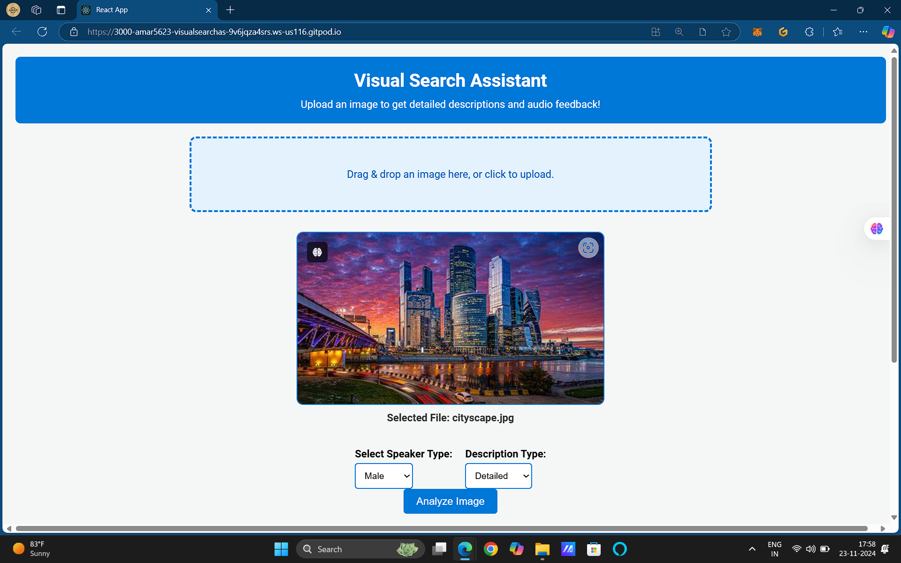
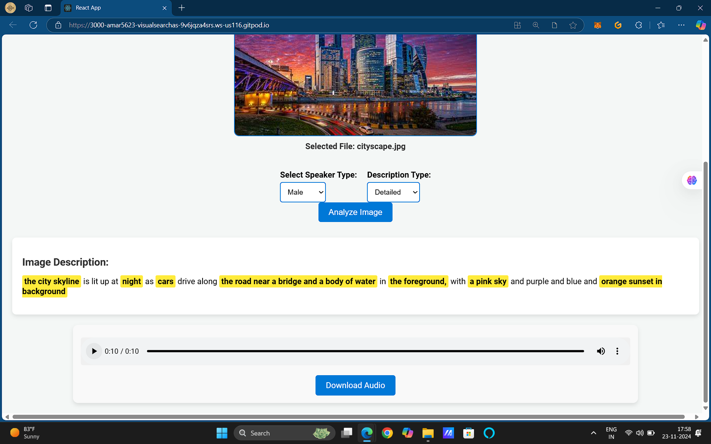

---

# Visual Search Assistant

## 📜 Overview

The **Visual Search Assistant** is a multimodal GenAI application that combines advanced image-to-text and text-to-speech capabilities. Users can upload images to receive detailed or simplified descriptions, along with audio playback of the descriptions for improved accessibility. This project is tailored to enhance inclusivity and interaction by leveraging cutting-edge models and user-centric design.

---

## 🎥 Demo Video

[](https://www.youtube.com/watch?v=lCXE8kKoQEQ)

> *Click the thumbnail to watch the 1-minute video showcasing the app’s features!*

---

## 🚀 Features

1. **Image-to-Text Captioning**  
   - Generate detailed or simplified descriptions for uploaded images using the **BLIP Image Captioning Model**.
   - Contextual refinement via the **CLIP Model** ensures precision in descriptions.
   
2. **Text-to-Speech (TTS)**  
   - Convert captions into speech using **VITS TTS Models**.  
   - Choose between male and female voices for audio output.  

3. **Keyword Highlighting**  
   - Automatically extract and highlight key terms in the image description for enhanced understanding.

4. **Accessibility Support**  
   - ARIA-compliant frontend ensures compatibility with screen readers for visually impaired users.

---

## 💡 How It Works

1. **Image Upload**  
   - Drag and drop or select an image file.  

2. **Description Generation**  
   - The uploaded image is processed to generate a caption.  
   - Captions are cached in Redis for faster subsequent retrievals.  

3. **Audio Feedback**  
   - The description is converted to speech, which can be played or downloaded.

---

## 🛠 Installation Guide

Follow these steps to set up and run the project locally:

### 1. Prerequisites
- Python 3.11+
- Node.js (v16+)
- Redis
- CUDA-enabled GPU (optional but recommended for faster processing)

### 2. Backend Setup

1. Clone the repository:  
   ```bash
   git clone https://github.com/Amar5623/visual-search-assistant.git
   cd visual-search-assistant
   ```

2. Create a virtual environment and activate it:  
   ```bash
   python3 -m venv venv
   source venv/bin/activate
   ```

3. Install dependencies:  
   ```bash
   pip install -r requirements.txt
   ```

4. Set up environment variables:  
   - Create a `.env` file with the following:  
     ```
     HF_AUTH_TOKEN=your_huggingface_token
     PORT=8000
     ```

5. Start Redis:
    In a separate terminal, run
   ```bash
   cd backend
   sudo apt-get install redis-server
   redis-server
   ```

6. Run the backend server:  
   ```bash
   uvicorn main:app --host 0.0.0.0 --port 8000
   ```

### 3. Frontend Setup

1. Navigate to the `frontend` folder:  
   ```bash
   cd frontend
   ```

2. Install dependencies:  
   ```bash
   npm install
   ```

3. Set environment variables in `.env`:  
   ```
   REACT_APP_BACKEND_URL=http://localhost:8000
   ```

4. Start the development server:  
   ```bash
   npm start
   ```

### 4. Run the Application  
   - Access the application at `http://localhost:3000`.

---

## 📸 Screenshots

### Image Upload Interface  


### Description and Audio Output  


---

## 🌐 Live Demo  
Try the app here: [Visual Search Assistant Demo](https://your-live-app-url.com)  

---

## 🏆 Technical Highlights

- **Performance Optimizations**  
  - Cached image descriptions and audio in Redis reduce latency for repeated requests.  
  - Utilizes GPU acceleration for model inference, ensuring low response times.

- **Accuracy Enhancements**  
  - CLIP-based contextual refinement of image captions improves specificity and relevance.

- **Creative Optimizations**  
  - Dynamic selection of description complexity and TTS voices caters to diverse user preferences.

---

## 📊 Performance Metrics

| Metric                | Value              |
|-----------------------|--------------------|
| Average Response Time | ~7 seconds/image   |
| Audio Generation Time | ~3.1 seconds/file  |
| Cache Hit Rate        | ~85%               |

---

## 🤝 Contributions

Feel free to contribute to this project by submitting a pull request or opening an issue.

---
